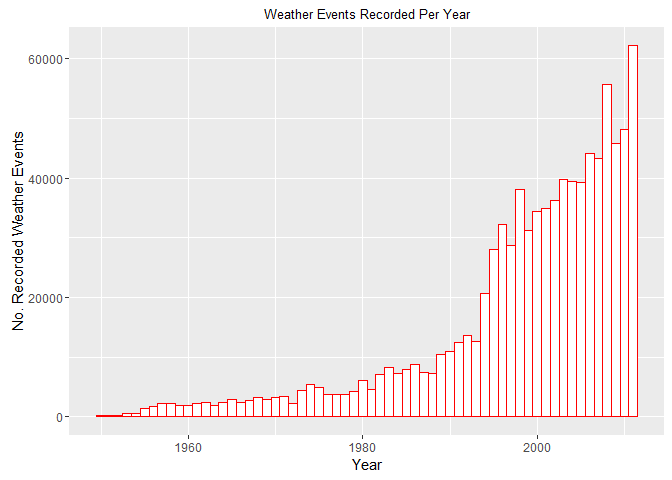
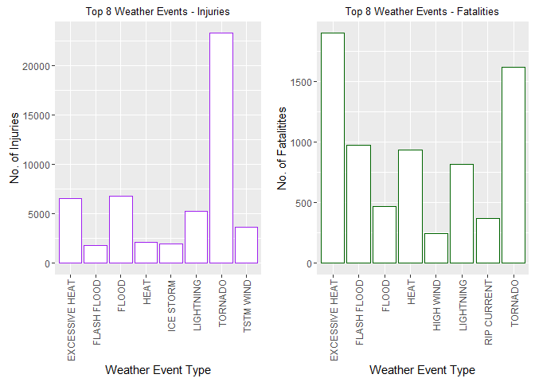
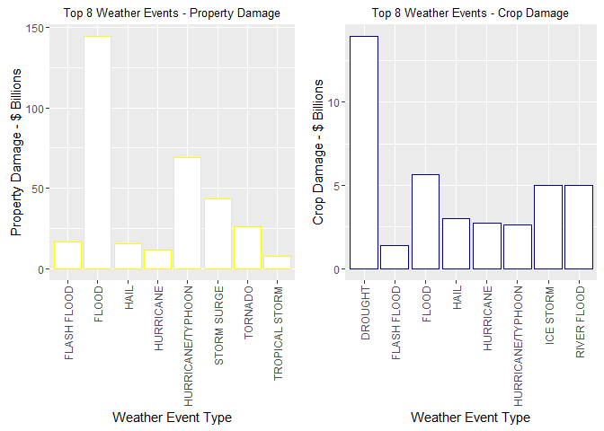

## Reproducible Research Course – Peer Assessment 2

###### (Part of Coursera - Johns Hopkins University - Data Science Specialization)


### USA Severe Weather Events - the impact on US population health and economy

#### Synopsis

###### The analysis uses data from the Storm Database of the NOAA (National Oceanic and Atmospheric Administration of the USA - https://www.ncdc.noaa.gov/stormevents/). The aim of the analysis is to examine data of weather events between 1950 and 2011 from the database and answer two questions: (1) which types of weather events are most harmful with respect to population health?; and (2) which types of weather events have the greatest economic consequences?


#### Settings and Preparation

###### The first step is examine the software, working directory on the local machine that is being used for the analysis.


```r
sessionInfo()
```

```
## R version 3.3.0 (2016-05-03)
## Platform: x86_64-w64-mingw32/x64 (64-bit)
## Running under: Windows 10 x64 (build 10586)
## 
## locale:
## [1] LC_COLLATE=English_United Kingdom.1252 
## [2] LC_CTYPE=English_United Kingdom.1252   
## [3] LC_MONETARY=English_United Kingdom.1252
## [4] LC_NUMERIC=C                           
## [5] LC_TIME=English_United Kingdom.1252    
## 
## attached base packages:
## [1] stats     graphics  grDevices utils     datasets  methods   base     
## 
## loaded via a namespace (and not attached):
##  [1] magrittr_1.5    formatR_1.4     tools_3.3.0     htmltools_0.3.5
##  [5] yaml_2.1.13     Rcpp_0.12.5     stringi_1.1.1   rmarkdown_0.9.6
##  [9] knitr_1.13      stringr_1.0.0   digest_0.6.9    evaluate_0.9
```

```r
getwd()
```

```
## [1] "C:/Users/evans/Documents/GitHub/RepData_PeerAssessment2"
```


#### Loading The Data

###### The NOAA storm data is available at: https://d396qusza40orc.cloudfront.net/repdata%2Fdata%2FStormData.csv.bz2

###### PDF documentation for the National Weather Service for this database is available at: https://d396qusza40orc.cloudfront.net/repdata%2Fpeer2_doc%2Fpd01016005curr.pdf


###### The next step is to download the file and store it in an R dataframe 'stormData'. The dimensions (using 'dim') and the first few rows of the database (using 'head') are called for a first look at the dataframe structure.


```r
# Download database file and store in 'stormData' dataframe
download.file("https://d396qusza40orc.cloudfront.net/repdata%2Fdata%2FStormData.csv.bz2", destfile = "StormData.csv.bz2")
stormData <- read.csv(("StormData.csv.bz2"), header=TRUE, stringsAsFactors = FALSE)

dim(stormData)
```

```
## [1] 902297     37
```

```r
head(stormData)
```

```
##   STATE__           BGN_DATE BGN_TIME TIME_ZONE COUNTY COUNTYNAME STATE
## 1       1  4/18/1950 0:00:00     0130       CST     97     MOBILE    AL
## 2       1  4/18/1950 0:00:00     0145       CST      3    BALDWIN    AL
## 3       1  2/20/1951 0:00:00     1600       CST     57    FAYETTE    AL
## 4       1   6/8/1951 0:00:00     0900       CST     89    MADISON    AL
## 5       1 11/15/1951 0:00:00     1500       CST     43    CULLMAN    AL
## 6       1 11/15/1951 0:00:00     2000       CST     77 LAUDERDALE    AL
##    EVTYPE BGN_RANGE BGN_AZI BGN_LOCATI END_DATE END_TIME COUNTY_END
## 1 TORNADO         0                                               0
## 2 TORNADO         0                                               0
## 3 TORNADO         0                                               0
## 4 TORNADO         0                                               0
## 5 TORNADO         0                                               0
## 6 TORNADO         0                                               0
##   COUNTYENDN END_RANGE END_AZI END_LOCATI LENGTH WIDTH F MAG FATALITIES
## 1         NA         0                      14.0   100 3   0          0
## 2         NA         0                       2.0   150 2   0          0
## 3         NA         0                       0.1   123 2   0          0
## 4         NA         0                       0.0   100 2   0          0
## 5         NA         0                       0.0   150 2   0          0
## 6         NA         0                       1.5   177 2   0          0
##   INJURIES PROPDMG PROPDMGEXP CROPDMG CROPDMGEXP WFO STATEOFFIC ZONENAMES
## 1       15    25.0          K       0                                    
## 2        0     2.5          K       0                                    
## 3        2    25.0          K       0                                    
## 4        2     2.5          K       0                                    
## 5        2     2.5          K       0                                    
## 6        6     2.5          K       0                                    
##   LATITUDE LONGITUDE LATITUDE_E LONGITUDE_ REMARKS REFNUM
## 1     3040      8812       3051       8806              1
## 2     3042      8755          0          0              2
## 3     3340      8742          0          0              3
## 4     3458      8626          0          0              4
## 5     3412      8642          0          0              5
## 6     3450      8748          0          0              6
```

###### The dataframe contains 902297 rows and 37 columns.

#### Data Processing

###### 1 - Grab the 'year' from BGN_DATE and convert to a numeric value in a seperate column. This will allow the dataframe to be analysed by year over the 1950 - 2001 timeperiod.

###### 2 - Subset dataframe to focus on the data types that are the focus of this analysis - 

###### Year ("year"); weather event type ("EVTYPE"); fatalities ("FATALITIES"); injuries ("INJURIES"); property damage and the associated  exponential ("PROPDMG" and "PROPDMGEXP"); crop damage and associated exponential ("CROPDMG" and "CROPDMGEXP").

###### The exponentials will be used for analysis of economic impact as they can be used to convert the crop and property damage values into a set of values with consistent numbering scale. This will make comparison of the values more straightforward.


```r
# grab year from BGN_DATE
stormData$year <- as.numeric(format(as.Date(stormData$BGN_DATE, format = "%m/%d/%Y %H:%M:%S"), "%Y"))

# check additional column is added to dataframe
dim(stormData)
```

```
## [1] 902297     38
```


###### The next step is to subset the dataframe into a new dataframe 'selectedData2' with the columns needed for the analysis.


```r
# Subset the dataframe into a new dataframe 'selectedData2' 
setcol <- c("EVTYPE","FATALITIES", "INJURIES", "PROPDMG", "PROPDMGEXP","CROPDMG", "CROPDMGEXP", "year")

selectedData2 <- stormData[setcol]
```

###### Use 'head' and 'dim' to review the structure of the subset data and the first few rows of the subset dataframe 'selectedData2'.


```r
head(selectedData2)
```

```
##    EVTYPE FATALITIES INJURIES PROPDMG PROPDMGEXP CROPDMG CROPDMGEXP year
## 1 TORNADO          0       15    25.0          K       0            1950
## 2 TORNADO          0        0     2.5          K       0            1950
## 3 TORNADO          0        2    25.0          K       0            1951
## 4 TORNADO          0        2     2.5          K       0            1951
## 5 TORNADO          0        2     2.5          K       0            1951
## 6 TORNADO          0        6     2.5          K       0            1951
```

```r
dim(selectedData2)
```

```
## [1] 902297      8
```

###### Plot events recorded for each year.


```r
# Plot events for each year.
library(ggplot2)
eventsplot <- ggplot(selectedData2, aes(year)) + geom_histogram(binwidth=1, fill="white", colour="red") + xlab("Year") + ylab("No. Recorded Weather Events") + ggtitle("Weather Events Recorded Per Year") + theme(plot.title = element_text(size = 10))

eventsplot
```

<!-- -->


###### The plot indicates that from 1950 to the early 1990's there are relatively few recorded events. This suggests patchy data collection and limitations due to the technology available. The analysis will therefore focus on data from 1993 onwards - when the number of recorded events per year increases significantly.


```r
# subset to only data from 1993 onwards
selectedData3 <- selectedData2[selectedData2$year >= 1993, ]

# Check dataframe for reduction in rows. No. of columns should stay the same. 
dim(selectedData3)
```

```
## [1] 714738      8
```


###### The subset dataframe has 714738 rows and the 8 specified columns required for this analysis.

##### Update exponential values to numeric equivalent 

###### The next step is to identify the unique variables in PROPDMGEXP


```r
unique(selectedData3$PROPDMGEXP)
```

```
##  [1] ""  "B" "K" "M" "m" "+" "0" "5" "6" "?" "4" "2" "3" "h" "7" "H" "-"
## [18] "1" "8"
```

###### The are a number of character variables that need to be converted to the correct exponential numeric equivalent ("H" and "h" is hundred and is replaced by "2" for 2 zeros. Also, "k" for thousand/ 3 zeros; "m" for million and "B" for billion. "+","-" and "?"=" are also replaced by zero. 


```r
# Replace PROPDMGEXP to the equivalent numeric value.
library(plyr)
selectedData3$propExp <- selectedData3$PROPDMGEXP
selectedData3$propExp <- revalue(selectedData3$propExp, c("K"="3","M"="6","m"="6","B"="9","+"="0","h"="2","H"="2","-"="0","?"="0"))
selectedData3$propExp[selectedData3$propExp==""] <- "0"
selectedData3$propExp <- as.numeric(selectedData3$propExp)
```

###### Identify the unique variables in CROPDMGEXP


```r
unique(selectedData3$CROPDMGEXP)
```

```
## [1] ""  "M" "K" "m" "B" "?" "0" "k" "2"
```


###### Again, there are a number of character variables that need to be converted to the correct exponential numeric equivalent.


```r
# Replace CROPDMGEXP to the equivalent numeric value.
selectedData3$cropExp <- selectedData3$CROPDMGEXP
selectedData3$cropExp <- revalue(selectedData3$cropExp, c("K"="3","k"="3", "M"="6", "m"="6", "B"="9", "?"="0"))
selectedData3$cropExp[selectedData3$cropExp==""] <- "0"
selectedData3$cropExp <- as.numeric(selectedData3$cropExp)

selectedData3$TOTALPROPDMG <- selectedData3$PROPDMG * (10^selectedData3$propExp)

selectedData3$TOTALCROPDMG <- selectedData3$CROPDMG * (10^selectedData3$cropExp)

# Convert to Billions by dividing by 1000000000
selectedData3$TOTALPROPDMG <- selectedData3$TOTALPROPDMG / 1000000000

# Convert to Billions by dividing by 1000000000
selectedData3$TOTALCROPDMG <- selectedData3$TOTALCROPDMG / 1000000000

# Use 'head' and 'dim' to review the structure of dataframe after data processing steps.  
head(selectedData3)
```

```
##                       EVTYPE FATALITIES INJURIES PROPDMG PROPDMGEXP
## 187560         FREEZING RAIN          0        0       0           
## 187561                  SNOW          0        0       0           
## 187562 ICE STORM/FLASH FLOOD          0        2       0           
## 187563              SNOW/ICE          0        0       0           
## 187564          WINTER STORM          4        0       5          B
## 187565              SNOW/ICE          0        0       0           
##        CROPDMG CROPDMGEXP year propExp cropExp TOTALPROPDMG TOTALCROPDMG
## 187560       0            1995       0       0            0            0
## 187561       0            1995       0       0            0            0
## 187562       0            1994       0       0            0            0
## 187563       0            1995       0       0            0            0
## 187564       0            1993       9       0            5            0
## 187565       0            1995       0       0            0            0
```

```r
dim(selectedData3)
```

```
## [1] 714738     12
```


#### Results

##### Question 1 - Population Health

###### To answer question - which types of weather events are most harmful with respect to population health? Identify the top 8 weather events with the largest number of injuries; and also identify the top 8 weather events with the largest number of fatalities.  Print out these results.


```r
# Aggregate 8 weather event types with the largest number of injuries
injuries <- aggregate(INJURIES ~ EVTYPE, selectedData3, sum)
injuries <- injuries[order(-injuries$INJURIES), ][1:8, ]

# Print results
print(injuries)
```

```
##             EVTYPE INJURIES
## 834        TORNADO    23310
## 170          FLOOD     6789
## 130 EXCESSIVE HEAT     6525
## 464      LIGHTNING     5230
## 856      TSTM WIND     3631
## 275           HEAT     2100
## 427      ICE STORM     1975
## 153    FLASH FLOOD     1777
```


```r
# Aggregate 8 weather event types with the largest number of fatalities
fatalities <- aggregate(FATALITIES ~ EVTYPE, selectedData3, sum)
fatalities <- fatalities[order(-fatalities$FATALITIES), ][1:8, ]

# Print results
print(fatalities)
```

```
##             EVTYPE FATALITIES
## 130 EXCESSIVE HEAT       1903
## 834        TORNADO       1621
## 153    FLASH FLOOD        978
## 275           HEAT        937
## 464      LIGHTNING        816
## 170          FLOOD        470
## 585    RIP CURRENT        368
## 359      HIGH WIND        248
```

###### Using ggplot2 to generate visuals plot of these results in a single figure:


```r
# Load packages for plotting charts
library(ggplot2)
library(gridExtra)
```

```
## Warning: package 'gridExtra' was built under R version 3.3.1
```

```r
# Plot top 8 weather event types with the largest number of injuries
injuriesPlot <- ggplot(injuries, aes(x=EVTYPE, y=INJURIES)) + geom_bar(stat="identity", fill="white", colour="purple") + xlab("Weather Event Type") + ylab("No. of Injuries") + ggtitle("Top 8 Weather Events - Injuries") + theme(axis.text.x=element_text(angle=90,hjust=1,vjust=0.5)) + theme(plot.title = element_text(size = 10))

# Plot 8 weather event types with the largest number of fatalities
fatalitiesPlot <- ggplot(fatalities, aes(x=EVTYPE, y=FATALITIES)) + geom_bar(stat="identity", fill="white", colour="darkgreen") + xlab("Weather Event Type") + ylab("No. of Fatalitites") + ggtitle("Top 8 Weather Events - Fatalities") + theme(axis.text.x=element_text(angle=90,hjust=1,vjust=0.5)) + theme(plot.title = element_text(size = 10))

# Arrange both results in the same plot grid.
grid.arrange(injuriesPlot, fatalitiesPlot, ncol =2)
```

<!-- -->

###### Tornado is the weather event type generating the largest number of injuries across the USA during the 1993 - 2011 time period.

###### Excessive Heat is the weather event type generating the largest number of fatalitites across the USA during the 1993 - 2011 time period. Tornado is a close second for largest number of fatalities.

##### Question 2 - greatest economic consequences. 

###### To answer question - (2) which types of weather events have the greatest economic consequences? Identify the top 8 weather events with the greatest cost values for crop damage; and also identify the top 8 weather events with the greatest cost values for property damage.  Print out these results.


```r
# Aggregate 8 weather event types with the greatest property damage
agrProperty <- aggregate(TOTALPROPDMG~EVTYPE, data = selectedData3,"sum")
property <- agrProperty[order(-agrProperty$TOTALPROPDMG), ][1:8, ]
property
```

```
##                EVTYPE TOTALPROPDMG
## 170             FLOOD   144.657710
## 411 HURRICANE/TYPHOON    69.305840
## 670       STORM SURGE    43.323536
## 834           TORNADO    26.349182
## 153       FLASH FLOOD    16.822674
## 244              HAIL    15.735268
## 402         HURRICANE    11.868319
## 848    TROPICAL STORM     7.703891
```


```r
# Aggregate 8 weather event types with the greatest crop damage
agrCrop <- aggregate(TOTALCROPDMG~EVTYPE, data = selectedData3,"sum")
crop <- agrCrop[order(-agrCrop$TOTALCROPDMG), ][1:8, ]
crop
```

```
##                EVTYPE TOTALCROPDMG
## 95            DROUGHT    13.972566
## 170             FLOOD     5.661968
## 590       RIVER FLOOD     5.029459
## 427         ICE STORM     5.022113
## 244              HAIL     3.025954
## 402         HURRICANE     2.741910
## 411 HURRICANE/TYPHOON     2.607873
## 153       FLASH FLOOD     1.421317
```


###### Using ggplot2 to generate visuals plot of these results in a single figure:


```r
# Plot top 8 weather event types with the  with the greatest property damage
propPlot <- ggplot(property, aes(x=EVTYPE, y=TOTALPROPDMG)) + geom_bar(stat="identity", fill="white", colour="yellow") + xlab("Weather Event Type") + ylab("Property Damage - $ Billions") + ggtitle("Top 8 Weather Events - Property Damage") + theme(axis.text.x=element_text(angle=90,hjust=1,vjust=0.5)) + theme(plot.title = element_text(size = 10))

# Plot top 8 weather event types with the with the greatest crop damage
cropPlot <- ggplot(crop, aes(x=EVTYPE, y=TOTALCROPDMG)) + geom_bar(stat="identity", fill="white", colour="darkblue") + xlab("Weather Event Type") + ylab("Crop Damage - $ Billions") + ggtitle("Top 8 Weather Events - Crop Damage") + theme(axis.text.x=element_text(angle=90,hjust=1,vjust=0.5)) + theme(plot.title = element_text(size = 10))

# Arrange both results in the same plot grid.
grid.arrange(propPlot, cropPlot, ncol =2)
```

<!-- -->

###### Flood is the weather event type generating the greatest economic consequence for property.

###### Drought is the weather event type generating the greatest economic consequence for crops.

###### These are both across the USA during the 1993 - 2011 time period (when more substantial weather events records are available).

